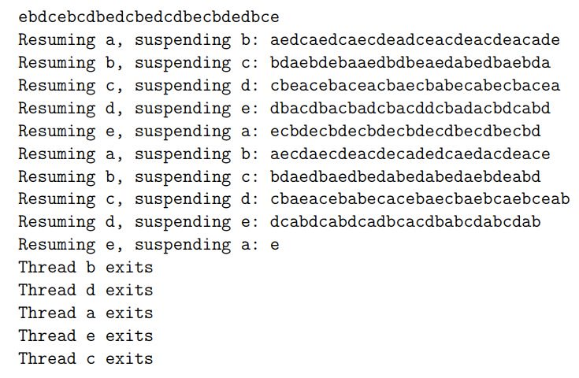

# GUI - CW 05 - Zad 2

Napisz program opisany poniżej:
- program tworzy kilka wątków, przekazując do ich konstruktorów kolejne litery; każdy wątek drukuje od czasu do czasu swoją literę (odstęp czasu między drukowaniem może być losową liczbą milisekund z przedziału [100, 1000]);
- wszystkie wątki są uruchamiane, ale pierwszy jest wstrzymywany;
- inny wątek, nazwijmy go głównym wątkiem, od czasu do czasu (na przykład co 5 sekund) wznawia wątek, który jest wstrzymany i wstrzymuje następny - cyklicznie, czyli jeśli ostatni został wznawiony, pierwszy jest wstrzymywany.
Po kilku takich cyklach (na przykład dziesięciu), główny wątek zatrzymuje wszystkie wątki, które w wyniku kończąc swoją pracę, wypisują odpowiedni komunikat.

Ważne:
Wszystkie wątki są tworzone tylko raz, na początku programu. Metody stop, resume, suspend i destroy z klasy Thread są wewnętrznie niebezpieczne i nie powinny być używane!
Wyjście programu może wyglądać jak poniżej. Tutaj zostało uruchomionych pięć wątków, odpowiadających literom 'a', ... ,'e', ale zwiększenie liczby wątków/liter powinno być kwestią modyfikacji tylko jednej linii

